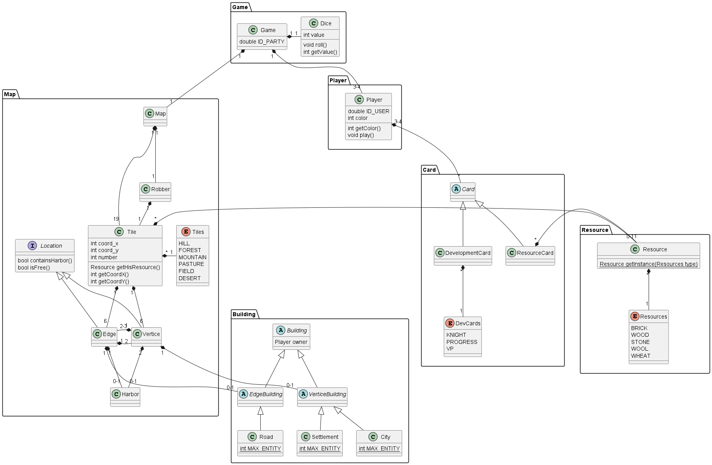

:project: Catane
= Analyse du domaine

== Travail à réaliser

Objectif::
Description du jeu _{project}_ sous la forme d'un diagramme de classes conceptuelles et d'actions.

Moyens::
Utilisez une approche itérative pour découvrir toutes les classes conceptuelles et les actions du jeu.

== Introduction 

== Modèle du domaine

=== Zoom sur TileImpl

image::classDiagramTile.png[]

.Classes conceptuelles
[plantuml]
....
include::example$cd-analyse.puml[]
....

== Cas d'utilisation

[NOTE]
====
Utilisez le canevas proposé par Alistar Cockburn pour décrire les cas d'utilisation.

Additionnellement, utilisez des diagrammes d'activités UML pour illustrer les cas d'utilisation.
====

=== Cas d'utilisation "Mise en place d'une partie"

include::../partials/uc-preparation.adoc[]

.Diagramme d'activités: Mise en place d'une partie
[plantuml]
....
include::example$ad-mise-en-place.puml[]
....

=== Cas d'utilisation Jouer un tour

include::../partials/uc-playturn.adoc[]

== Activités

[NOTE]
====

====

== Opérations

// include::uc-template.adoc[]
